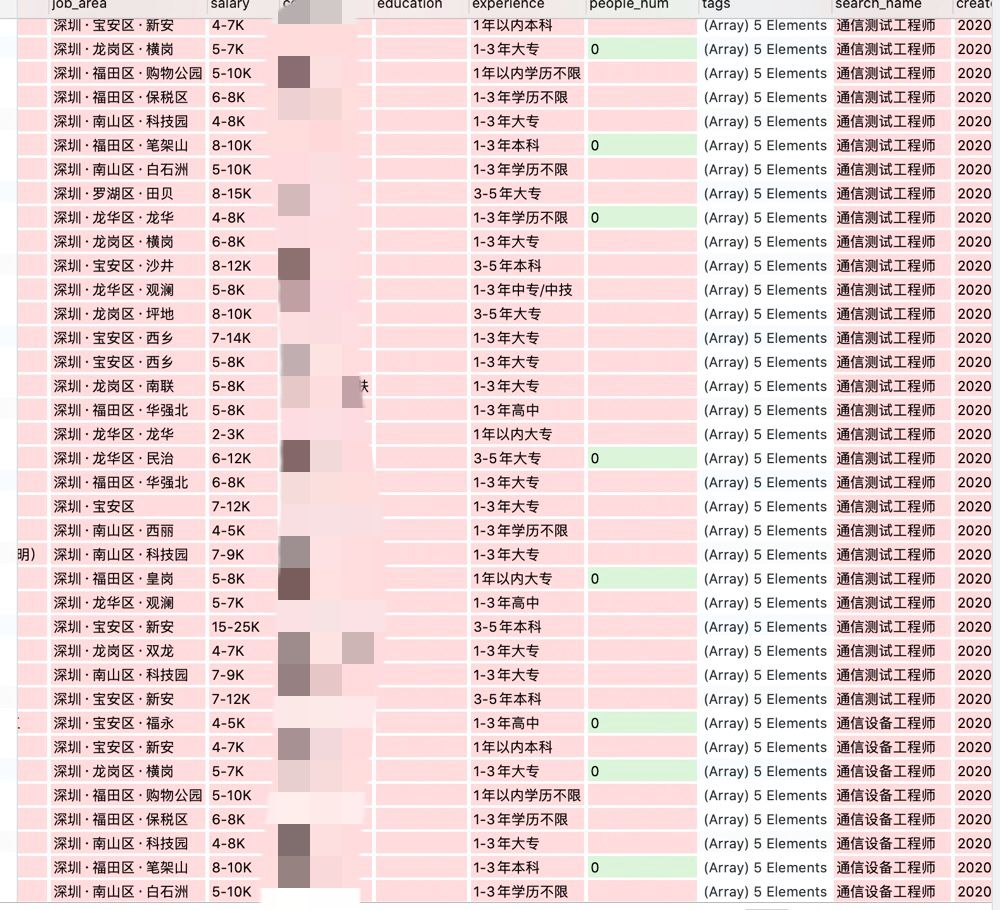

#boss招聘 web页面爬虫，以及小的数据可视化的展示

##采用技术栈：
1. selenium
 > 爬虫的主要程序，通过模拟浏览器行为得到数据
2. mongodb
 > 用于存储数据 (其实可以用csv只是比较懒)
3. pyecharts
 > 用于数据展示

##如何开始
###本项目采用的是 Chrome 驱动 故需要下载对应的驱动
###sulenium 浏览器驱动下载地址：
###如何查看适合的版本：
1. google 查看对应版本号

2. 到 http://chromedriver.storage.googleapis.com/index.html?path=87.0.4280.88/
下载对应驱动
3. 解压下载包，把里面的驱动放入到项目mul web_driver/ 中，查看conf/app.ini中的驱动配置名称是否相同，不相同修改即可
>假如下载的文件为 1111.exe 则修改 为  web_driver = web_driver/1111.exe
4. pip3 install -r requirements.txt
5. 检查conf/app.ini 中的 MongoDB配置 ，如果没有mongodb ，请百度搜索自行安装
6. 运行
> python3 main.py -t r 则运行爬虫程序
----
> python3 main.py -t w 则运行渲染数据

建议爬虫运行完毕后再运行渲染数据，则会在temp 目录中生成all.html
文件，点击即可查看

数据库文件展示

可视化展示

###题外音
本项目为闲雅花一天写出来的东西，仅在mac上运行通过，如有问题请提个issues
看到则会回复

本项目目前筛选的行业仅it，且为深圳市，如果想爬取深圳市所有的职业数据，请去除task/boss.py  104 行中的 if 判断即可

如果想修改成其他市的话  task/boss.py 第16行的地址 改为想爬取的市区的地址，这样会导致地图无法正确展示，等有start的时候再慢慢更新吧

如遇到反爬，进行自行更换vpn

本项目爬取过的MongoDB数据库文件放在img/job_info.js
导入即可 使用 python3 main.py -t w 导出可视化数据

就这样吧，本项目仅用于学习，娱乐

